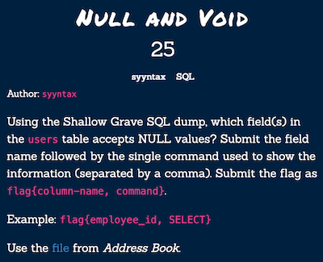
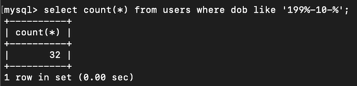
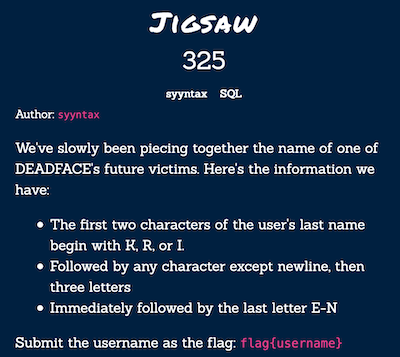
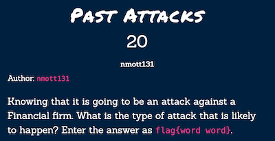
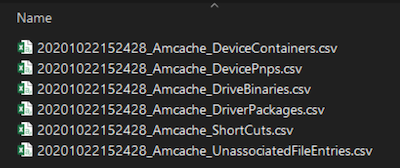
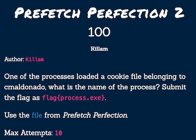
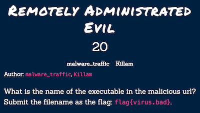
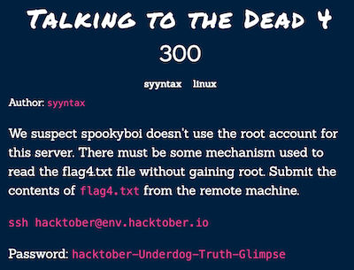

Hacktober CTF is an event that organized by Cyber Hacktics. I participated with [@batcain](https://github.com/batcain) and [@hackerbecker](https://github.com/ebubekirtrkr) as Numinious Episcopate. We solved 51 challenges in SQL, Programming, Steganography, Cryptography, OSINT, Forensics, Traffic Analysis, Linux and Web Exploitation categories. I'll be showing some of them right now. You can find other challenges at hackerbecker's [github](https://github.com/ebubekirtrkr/write-ups/tree/master/hacktoberCTF-2020).

## SQL

### Past Demons


We have a sql file out.db. When I see the file type in terminal it was SQLite 3.x database. So I opened it with sqlite3.

As we see there are some passwords belongs to users. spookyboi's id is 8. I searched **59dea36d05aacaa547de42e9956678e7** on google and find some hash-password list on github. There it is our spookyboi's password.


    59dea36d05aacaa547de42e9956678e7:zxcvbnm

It is MD5 hash, so you can decrypt it [online](https://hashes.com/en/decrypt/hash) to find the password.

**_flag{zxcvbnm}_**

### Address Book


I just opened the sql file with text editor and search for the luciafer. I got lucky with lucia. There was a user LUCIA and her email address.
    
    luc1afer.h4vr0n@shallowgraveu.com

We can follow different way for this and further related SQL challenges. We can create our local database with given sql file. First conntect to mysql and create database.

```bash
$ mysql -uroot -p
```

```sql
CREATE DATABASE westridge;

USE westridge;
```

Then from another terminal, import sql file to database you create. In my case its westridge.

``` bash
$ mysql -uroot -p westridge < /path_to_file/shallowgraveu.sql
```
Now search for email like 'luc' from users table.

```sql
SELECT * FROM users WHERE email LIKE '%luc%';
```


**_flag{luc1afer.h4vr0n@shallowgraveu.com}_**

### Null and Void



We need to find the field accepts NULL values and command to show the information. Quickly I look at the create table description in the sql file. middle column has DEFAULT NULL attribute. For command first I tried SELECT but it wasn't the right choice, so I tried SHOW instead.

Another way is to show in terminal.


**_flag{middle, SHOW}_**

### Body Count


We need to count users in Shallow Grave University.

```sql
SELECT COUNT(*) FROM users;
```


**_flag{900}_**

### Calisota


We need to find California and Minnesota state_id's and count users.

```sql
SELECT * FROM states WHERE state_full="California" OR state_full="Minnesota";

SELECT COUNT(*) FROM users WHERE state_id=6 OR state_id=28;
```


**_flag{select count(*) from users where state_id=6 or state_id=28;}_**

### 90s Kid


Here is the query for number of kids in born October 90s.

```sql
SELECT COUNT(*) FROM users WHERE dob LIKE '199%-10-%';
```



**_flag{32}_**

### Jigsaw



I wrote regex that satisfies the requirements. 

``` sql
SELECT * FROM users WHERE last REGEXP '^[KRI][KRI]....[E-N]$';
```


Here is the user which last name is KRYSIAK.

**_flag{image.wa1k3624}_**

## Programming

### Red Rum 


We need to connect to nc service and send the Red Rum output. Here is my c++ function.

``` c++
#include <iostream>
using namespace std;

int main(int argc, const char * argv[]) {
    string arr[500];
        for (int i=1; i<=500; i++) {
            if (i % 3 == 0) {
                if ( i % 5 == 0) {
                    cout << "RedRum,";
                }else{
                    cout << "Red,";
                }
            }else if(i % 5 == 0){
                cout << "Rum,";
            }else{
                cout << i << ",";
            }
        }
}
```

But if you want python, here it is.

``` python
for i in range(1,501):
    if i % 3 == 0 and i % 5 == 0:
        print('RedRum,', end='')
    elif i % 3 == 0:
        print('Red,', end='')
    elif i % 5 == 0:
        print('Rum,', end='')
    else:
        s = str(i)+','
        print(s, end='')

```


**_flag{h33eeeres_j0hnny!!!}_**

### Stairway To Hell


Write code to build a staircase but put it in one line -__-

``` c++
#include <iostream>
using namespace std;

int main(int argc, const char * argv[]) {
    int num = 666;
    int j= 0;
    for (int i=0; i<30; i++) {
        for (j=0; j<i+1; j++) {
            cout << num + j << " ";
        }
        num = num + j;
    }

    return 0;
}
```


**_flag{plung3_to_the_4by55}_**

### Password Check


Actually I didn't do anything about programming in this challenge. I just use hashcat and used [haveibeenpwned](https://haveibeenpwned.com/Passwords) site for find how many times this password compromised. Download the hash [list](https://pastebin.com/FL1R0jbn) and give it to hashcat as input.


**_flag{55001}_**

## OSINT



It was watering hole attack.

**_flag{watering hole}_**

## Forensics

### Amcaching In


I used Eric Zimmerman's AmcacheParser tool.

https://ericzimmerman.github.io/
https://github.com/EricZimmerman/AmcacheParser

Give the hve file as input.




I searched "mpowers" in UnassociatedFileEntries.

We see that mpowers downloaded python-3.7.0-amd64-webinstall.exe. Flag is python.


**_flag{python}_**

### Prefetch Perfection 2



There is another handy tool in Eris Zimmerman's repo. PECmd (Prefetch Explorer Command Line)

https://github.com/EricZimmerman/PECmd

Execute command and we got 2 output file.

timestamp_PECmd_Output.csv
timestamp_PECmd_Output_timeline.csv


Find "CMALDONADO\APPDATA\ROAMING\MICROSOFT\WINDOWS\COOKIES" in PECmd_Output.csv. There are three executable name, flag is DLLHOST.EXE.


**_flag{dllhost.exe}_**

## Traffic Analysis

### Remotely Administrated Evil



We need to find executable file in given pcap file. There is GET request to /ot/solut.exe.


**_flag{solut.exe}_**

### Remotely Administrated Evil 3


Search for "hodrc.org/ot/solut.exe rat" and find [this](https://any.run/report/2cb072d9fcc9413a91b245513366c7bb52bfec2638f67c158520c2854e264208/398235d6-6d1a-465e-b96b-52122be095e1) site. "Netwire is an advanced RAT" this is the key line.


We can see our URL in Network activity.


**_flag{netwire rat}_**

### Evil Corp's Child


We can see files URL in GET requsest. Download the file and get MD5 hash of it.


**_ flag{a95d24937acb3420ee94493db298b295}_**

### Evil Corp's Child 3


Filter ip.src == 37.205.9.252. Look https traffic start, Server Hello. In TLS there is localityname.


**_flag{Mogadishu}_**

## Linux

### Talking To The Dead 1


Connect with ssh to the server. Find for flag1.txt


**_flag{cb07e9d6086d50ee11c0d968f1e5c4bf1c89418c}_**

### Talking To The Dead 2


Use find command again but it didn't find. Then I find for hidden files. Yes, there it is.


**_flag{728ec98bfaa302b2dfc2f716d3de7869f3eadcbf}_**

### Talking To The Dead 3


flag3.txt is in the spookyboi's home directory. We need to switch user and use password that we find earlier as Past Demons flag. Then read it.


**_flag{445b987b5b80e445c3147314dbfa71acd79c2b67}_**

### Talking To The Dead 4



flag4.txt is in root's home directory. It says spookyboi doesn't use root account. We can search for SUID files. There is /usr/local/bin/oujia. It reads the given file.


**_flag{4781cbffd13df6622565d45e790b4aac2a4054dc}_**
