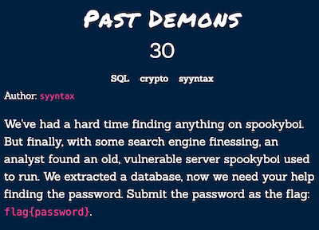

Hacktober CTF is an event that organized by Cyber Hacktics. I participate with my friends batcain and hackerbecker as Numinious Episcopate. We solved 51 challenges in SQL, Programming, Steganography, Cryptography, OSINT, Forensics, Traffic Analysis, Linux and Web Exploitation categories. I'll be showing some of them right now.

## SQL

### Past Demons - 30p



We have a sql file out.db. When I see the file type in terminal it was SQLite 3.x database. So I opened it with sqlite3.

As we see there are some passwords belongs to users. spookyboi's id is 8. I searched **59dea36d05aacaa547de42e9956678e7** on google and find some hash-password list on github. There it is our spookyboi's password.


    59dea36d05aacaa547de42e9956678e7:zxcvbnm

It is MD5 hash, so you can decrypt it [online](https://hashes.com/en/decrypt/hash) to find the password.

**_flag{zxcvbnm}_**

### Address Book - 50p


I just opened the sql file with text editor and search for the luciafer. I got lucky with lucia. There was a user LUCIA and her email address.
    
    luc1afer.h4vr0n@shallowgraveu.com

We can follow different way for this and further related SQL challenges. We can create our local database with given sql file. First conntect to mysql and create database.

```bash
$ mysql -uroot -p
```

```sql
CREATE DATABASE westridge;

USE westridge;
```

Then from another terminal, import sql file to database you create. In my case its westridge.

``` bash
$ mysql -uroot -p westridge < /path_to_file/shallowgraveu.sql
```
Now search for email like 'luc' from users table.

```sql
SELECT * FROM users WHERE email LIKE '%luc%';
```


**_flag{luc1afer.h4vr0n@shallowgraveu.com}_**

### Null and Void - 25p


We need to find the field accepts NULL values and command to show the information. Quickly I look at the create table description in the sql file. middle column has DEFAULT NULL attribute. For command first I tried SELECT but it wasn't the right choice, so I tried SHOW instead.

Another way is to show in terminal.


**_flag{middle, SHOW}_**

### Body Count - 25p


We need to count users in Shallow Grave University.

```sql
SELECT COUNT(*) FROM users;
```


**_flag{900}_**

### Calisota - 75p


We need to find California and Minnesota state_id's and count users.

```sql
SELECT * FROM states WHERE state_full="California" OR state_full="Minnesota";

SELECT COUNT(*) FROM users WHERE state_id=6 OR state_id=28;
```


**_flag{select count(*) from users where state_id=6 or state_id=28;}_**

### 90s Kid - 150p


Here is the query for number of kids in born October 90s.

```sql
SELECT COUNT(*) FROM users WHERE dob LIKE '199%-10-%';
```


**_flag{32}_**

### Jigsaw - 325p


I wrote regex that satisfies the requirements. 

``` sql
SELECT * FROM users WHERE last REGEXP '^[KRI][KRI]....[E-N]$';
```


Here is the user which last name is KRYSIAK.

**_flag{image.wa1k3624}_**

## Programming

## OSINT

## Forensics

## Traffic Analysis

## Linux
