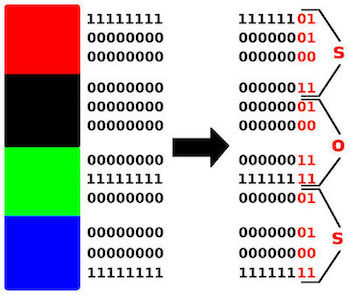
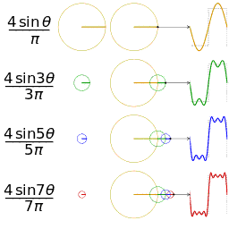

I wrote this article with [@batcain](https://github.com/batcain) and [Bersun](https://github.com/Rverdoc) for MDISEC community. You can find more articles in [github](https://github.com/mdisec/topluluk-makale).

Steganography is the science of hiding information within cover objects. The main purpose of this process is to convey the message to the person to whom the data is to be delivered without attracting the attention of third parties.

The question is often asked why we should use steganography instead of cryptography. In cryptography, the message is encrypted and only the recipient can decrypt the encrypted message. The main goal is to protect the content of a message. However, when a message is encrypted, third parties who see the encrypted message can understand the existence of a message, and it may be possible to crack the message with various techniques. The main purpose for steganography is that no one except the recipient is aware of the existence of the message. In other words, steganography stores the cover object in a way that everyone can see but cannot understand the existence of the message. Steganography basically aims to exploit the human perspective.

In addition, due to the restrictions on encryption and freedom of expression in some countries, the steganography method is used.

Some technical terms will be used throughout this article. The terminalogy will be explained in this section and the terms here will be used for the remainder of the article.

**Cover:** Carrier file. It can be an image or an audio file. The information is hidden in it.
**Payload:** It is the content to be kept.
**Stego-medium:** The message carrier is the new document that appears after being embedded in the file.
**Steganalysis:** It is the detection of hidden information using steganography.
**Generation:** It is the process of creating a special carrier file for the information to be stored.

## Text Steganography

Another point that should be considered for steganography is that the carrier file on which the message will be hidden must contain enough unnecessary data. The text steganography method is not used that much because there is very little unnecessary data in text files that could hide information.

For text steganography, tab, space and line break characters are used in the text, these characters are called "Whitespace characters". The invisibility of these characters in text display programs is utilized.

[Whitespace steganograpy example](../assets/files/stego/Return_of_the_Nigerian_Prince)

## Image Steganography

To understand image steganography, it is first necessary to understand how the image works. For the computer, image is the expression of the light intensity in pixels and the color channels (R, G, B) in the form of a sequence. Image files are classified according to their color depth. Assuming the bit value as n to calculate the number of colors used in the color palette, we can use the 2ⁿ operation.

For example, we can say that an 8-bit image contains 256 different color values. In today's image format, we will often see 8-bit, 24-bit images. Since there will be more than 16 million colors in 24-bit images, using 24-bit format in image steganography is a logical choice for the human eye not to detect the stored information. However, 24-bit is not suitable for all situations. If you want to apply steganography to an image in black and white, gray tones, 8-bit image depth will be more appropriate in terms of color palette.

Another case in which 8-bit image depth overcomes 24-bit image depth is dimension comparison. If you are going to store a message in a 24-bit image, the size difference between the original carrier file and the stego-medium will be greater. In case of high file size, file formats should also be selected according to compression methods. Since the compression algorithm of the JPEG file is more efficient than the PNG file compression algorithm, it makes more sense to use the large stego-medium file with the jpeg format.

### Image Steganography Methods

#### Least Significant Bit (LSB)

According to the color depth value of the image file; When the image is divided into binary blocks, the rightmost bit is the bit that affects the binary value the least. The method takes its name from here. When this bit is changed, it has little effect on the color value. As a result, the human eye cannot notice the change.

For the steganalysis of this method, image filters can be used to understand the change in RGB values. In this way, when the existence of a stored information is proven, LSB values ​​are obtained by using tools or simple scripts. Later, when these values ​​are converted from binary format to the format of the message, the process is reversed. As a result of this process, the color values ​​of the changed pixels also change.

Color planes are used for detection. The stegsolve tool written in java, which you can use for this detection process, can be very useful. Stegsolve and similar tools apply color filters to the image you want to examine, allowing the modified pixels to be displayed within that image. The main reason this method works is because of its optical principles. If a bit has changed color to dominate red and a filter except red is applied on it, bits with increased red value will appear black. Only the changed bits will be revealed when the channel color filter on which the bit is changed is applied.

Images modified with this method are vulnerable to attacks such as cropping or tampering. These attacks cause the loss of data to be stored.

#### Filter Masking

It is mainly used for 24-bit images. The bits to be modified in the image are selected according to the given password. The binwalk tool, which is used to extract content hidden in some images, will not work here. Because the bits to write the message are determined with the help of a password.

Bits in the gray and red channels of the image are preferred for modification. After the message to be stored is converted to ASCII format, the bit values are checked. If the bit value of the message is 0, the value of the selected pixel is not changed; if the bit value of the message is 1, the pixel value is increased by 1.

#### Wavelet Steganography

The desired process is applied by changing the pixel values. Methods such as logarithmic transformations, power transformations, histogram equalization are applied to change the pixel values. These transformations provide direct manipulation of pixels. Wavelet image steganography model is based on pixel by pixel separation of high and low frequency information. DWT (Discrete Wavelet Transformation) is used in this method. Carrier file is parsed via DWT path, payload is parsed via DWT. The four frequency coefficients obtained from each one are combined and converted into stego-medium by applying IDWT (Inverse Discrete Wavelet Transformation).

## Audio Steganography

Voice steganography is slightly more complicated than image steganography. Signal processing, compression algorithms are used. There are quite a few methods for voice steganography, in this article we will discuss five of the commonly used methods instead of mentioning all the methods.

### Audio Steganography Methods

#### Least Significant Bit (LSB)

The LSB method we mentioned in image steganography is also encountered here. The method works the same as in image steganography. Similarly, since it is difficult for the human ear to perceive such small frequency changes, the steganography process takes place. However, it is not an effective method. It is not reliable enough as data may be lost if the stego-medium is modified.

#### Phase Coding

When the sound files are examined as structure, it is seen that they consist of header and sound data. For this method, data storage will be done in the data part, that is, after the first 44 bytes of header information. First, the audio data is divided into n segments. DFT (Discrete Fourier Transformation) algorithm is applied to each of these segments. A phase shift is made according to the values ​​in the binary file of our message to be stored. If the bit value of our message is 0, a new phase is created by shifting the first phase by artı / 2 in the positive direction. If the bit value is 1, the first phase is shifted by π / 2 in the negative direction to create a new phase. These changes are kept in the first segment only. After the message is added to the carrier file with this method, IDFT (Inverse Discrete Fourier Transformation) is applied to all segments. With this process, a value close to the previous value of the first segment is obtained.

Since all data insertion is processed in the first segment, clipping the audio file to a certain point will not harm the stored message. At the same time, since the phase change will not be very obvious in the audio, operations such as spectrum visualization can not be obtained at the detection stage.

#### Parity Coding

The parity bit is a bit added to the binary value. Its purpose is to check for future errors. The parity bit takes the value 1 or 0 depending on whether the total number of 1-bit in the binary is even (even parity bit) or odd (odd parity bit).

The signal is divided into different samples and adds each bit of the message to be hidden with a parity bit. If the parity bit of the sample is not equal to the bit of the message to be hidden, the LSB value of the sample is changed to achieve equality and the message is stored.

#### Spread Spectrum

It is a method of adding a message to a new frequency within the frequency of the original audio file. If you examine the frequencies in a color display with tools such as Sonicvisualizer, you can distinguish different frequencies because the color of different frequencies will be different. (As the frequency increases, high-frequency colors such as blue and purple, as the frequency decreases, colors such as yellow, orange, and red are used. Thus, different frequencies are visualized.)

One of the disadvantages of this method; This is because when a new frequency is added to the carrier file, it can be heard in the audio file, especially if this frequency is in the 20-20.000 Mhz range. In addition, as the frequency is added throughout the entire audio file, the stego-medium file may be corrupted after cracking and compression.

### References
• Huriye Özdemir, Nisan-Mayıs 2018, "Veri Gizleme Sanatı: Steganography", Arkakapı Dergi 2. Sayı, Sayfa 23-29  
• M. I. Khalil, Ekim 2011, "Image Steganography: Hiding Short Audio Messages Within Digital Images"  
• Sabu M. Thampi, 2004, "Information Hiding Techniques: A Total Review"  
• H.B Kekre - Archana Athawale - Swarnalata Rao - Uttara Athawale, Ekim 2010, "Information Hiding in Audio Signals"  
• P. Jayaram  - H. R. Ranganatha - H. S. Anupama, Ağustos 2011, "Information Hiding Using Audio Steganography - A Survey"   
• Sami Kumar - Gupta Banik - BandyopadhyayBarnali, Haziran 2012, "LSB Modification and Phase Encoding Technique of Audio Steganography Revisited"  
• Jisna Antony - Sobin C. c - Sherly A. p, Ağustos 2012, "Audio Steganography in Wavelet Domain - A Survey"  
• J. Anita Christaline - D. Vaishali, Haziran 2011, "Image Steganographic Techniques With Improved Embedding Capacity And Robustness"  
• Sudhanshi Sharma - Umesh Kumar, 2013, "Review of Transform Domain Techniques of Image Steganography"  
• K. Sharath Reddy, "Audio Steganography: Art of Hiding Secret Message", <https://www.slideshare.net/sharathkanjula1/audio-steganography-sharath>  
• Barış Ceviz, 18 Eylül 2018, "Shazam'ın Müzik Arama Algoritması Nasıl Çalışır?", <http://devnot.com/2018/shazam-in-muzik-arama-algoritmasi-nasil-calisir/>  
• Michael T. Raggo, 2004, "Steganography, Steganalysis & Cryptanalysis"  
• <https://www.blackhat.com/presentations/bh-usa-04/bh-us-04-raggo/bh-us-04-raggo-up.pdf>  
• Neil F. Johnson, <http://www.jjtc.com/index.html>  
• <http://www.georeference.org/doc/images_and_channels.htm>  
• <http://soundfile.sapp.org/doc/WaveFormat/> (more detail about WAVE)
