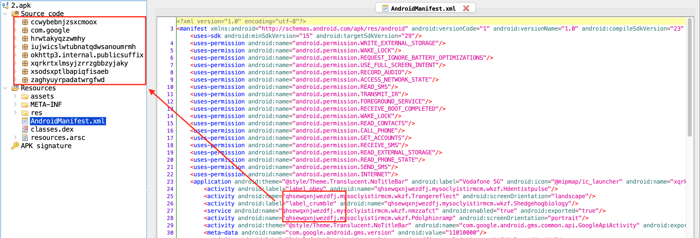
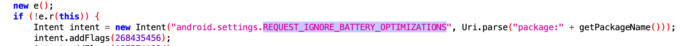

Cerberus is an Android malware that emerged in 2019 but was allegedly used for special operations until two years ago. It has been determined by the analysts that it was not built on a banking trojan and the Anubis malware whose source code had leaked, or many similar trojans, but was written completely from scratch.

### Static Analysis

MD5: 872ebba0dfe0a28da3e91b0ee4d6df32  
SHA1: 6a87c50179b08740bcab9da69a869d7c881f40c4  
SHA-256: 9832b1ade1907849fd7091e85f2c24bd8a4488ecd96f0638fc979d8858b25196  
C&C URL: http://botduke1.ug

The AndroidManifest.xml file shows that the application uses many permissions that can be used maliciously. In addition, the class name that is not in the code shows that the application loads some classes at run-time, and the classes that are not in the manifest file are put in order to complicate the code analysis.

When we hook the application, we see that the malware creates the Ab.json file and DexClassLoader is detected in this file. In this way, the actual dex file (Ab.json) is loaded at run-time.

After the application runs on the device, the files and directories under its own directory are listed as follows. 

When file.delete (Java level) and unlink syscall (System level) functions are hooked, it is seen that ring0.xml.bak, ring0.xml, Ab.json and Ab.dex files are tried to be deleted from the system.

After pulling the Ab.json file from the device, we can see the qhsewqxnjwezdfj.mysoclyistirmcm.wkzf class in AndroidManifest.xml. You can use [eybisi's jadx fork](https://github.com/eybisi/jadx) to hide enum classes and for extra features.

The RC4 algorithm is frequently used in malware. When we search for the "^" character in both the apk file and the Ab.json loaded at run-time, we can find the f class that encrypts with RC4.

The use of the decryption function used in the application is as follows.

#### Decryption

This method converts hex string to byte. The output is seen in the figure below:

The output of the previous function (h) is passed to the RC4 cipher. It also decrypts using a hard-coded key. The e string in the c class is used as the RC4 decryption key.

When the strings in the c class are decrypted with Base64+RC4, the strings used by the malware are accessed. You can use this script for decryption <https://gist.github.com/nurpabuccu/ac3fe35720d13890c0cc5317acf12a82>

The decrypted strings contain the application name, permissions, Telegram channel, parameters sent in the network traffic, the RC4 key used to analyze the network traffic, and the nick of the malware author "ring0", which is one of the important data about the malware.

Some these strings are also available in the ring0.xml file under the shared_prefs directory of the application on the device.

The malware can get all the contacts from the Android phone book with the CONTENT_URI field.

After getting the phone book, the malware can send sms messages.

Malware can enable call forwarding to the specified number.

The malware is also configured to run on Xiaomi systems. The code block for checking MIUI.UIversion is as follows:

Malware changes its behavior depending on the system language. The system looks at its default language and displays notifications based on that data (from the "string L" seen in class c below).

Android's battery optimization feature suspends the app to conserve battery, but since it's a malicious RAT, it constantly listens for commands from the attacker. Upon installation, the malware uses the REQUEST_IGNORE_BATTERY_OPTIMIZATIONS permission to prompt the user to ignore battery optimization for this app. Ignoring Battery Optimizations prevents the malware from being shut down by the battery optimization routine inside the device even when idle.

Also this method used for blocking attempt to uninstall the app from the device.

In above, we can see the message for blocking removal of TeamViewer app from the device. Cerberus use TeamViewe for remote access to victims device.

There are also some additional features in the malware. Using these commands the device can be turned into a RAT (Remote Access Trojan).

- grabbing_pass_gmail
- grabbing_lockpattern
- rat_connect
- change_url_connect
- request_permission
- change_url_recover
- run_admin_device
- url
- ussd
- sms_mailing_phonebook
- get_data_logs
- grabbing_google_authenticator2
- remove_app
- remove_bot
- notification
- send_sms
- call_forward
- run_app
- patch_update

### Dynamic Analysis

The application is hidden under the name "Vodafone 5G". When the application is launched, it asks the user to enable Accessibility Service. 

After the user grants the requested permission, the malware abuses it by giving it additional permissions, such as permissions to send messages, perform some action commands from C&C, and make calls without requiring any user interaction. It also disables Google Play Protect to prevent it from being discovered and deleted in the future. The malware appropriately grants it additional privileges and secures its persistence on the device. If the user tries to uninstall the malicious application or tries to disable the accessibility of the malicious application, it can prevent the user from uninstalling the software.

- TYPE_VIEW_CLICKED (eventType=1)
- TYPE_VIEW_FOCUSED (eventType=8)
- TYPE_VIEW_TEXT_CHANGED (eventType=16)
- TYPE_WINDOW_STATE_CHANGED (eventType=32)

For constant values of events: <https://www.apiref.com/android/android/view/accessibility/AccessibilityEvent.html>

After the user allows the Accessibility Service, the application icon is deleted from the menu. It then sends a request to the C&C server (http://botduke1.ug). 

Since C&C is not active during the analysis process, we cannot see all functions. When we look at the Cerberus analysis reports/blogs, we can see that the parameters listed below are used: 

- d_attacker_two
- d_attacker
- is_attacker
- info_device
- new_device
- saved_data_attacker
- saved_data_device
- pause_attacker
- saved_accessibility_events
- upgrade_patch
- connecting
- saved_all_sms
- saved_contacts
- saved_applications
- rat_connect
- rat_cmd

In the first request, the malware is trying to collect some data about the device. Requests sent by the device can be found as follows. info_device request contains device data such as Device Battery Level, Device Language. This request keeps the C&C server updated with new information about the device. 

In the data in the resolved HTTP request, many personal and sensitive data on the device are sent to http://botduke1.ug, where the application communicates, by POST method.

#### Features

Cerberus has the same capabilities as most other Android banking trojans, such as overlay attacks, SMS checking. The Trojan can also take advantage of keystrokes to expand its attack coverage.

- Overlaying: Dynamic (Local injects obtained from C2)
- Keylogging
- SMS listing
- SMS forwarding
- Device info collection
- Contact list collection
- Application listing
- Location collection
- SMS Sending
- Calls: USSD request making
- Calls: Call forwarding
- Remote actions: App installing
- Remote actions: App starting
- Remote actions: App removal
- Remote actions: Showing arbitrary web pages
- Remote actions: Screen-locking
- Notifications: Push notifications
- Hiding the App icon
- Preventing removal
- Emulation-detection
- Stealing 2FA tokens

On August 2020, Cerberus group officially announced the project is indeed dead because of Google Play Protects new functionality. Forum admin who bought Cerberus, shared the source code publicly.

### References
<https://pentest.blog/n-ways-to-unpack-mobile-malware/>  
<https://koodous.com/apks>  
<https://www.threatfabric.com/blogs/cerberus-a-new-banking-trojan-from-the-underworld.html>  
<https://www.biznet.com.tr/wp-content/uploads/2020/08/Cerberus.pdf>  
<https://www.avira.com/en/blog/in-depth-analysis-of-a-cerberus-trojan-variant>  
<https://securitynews.sonicwall.com/xmlpost/coronavirus-themed-android-rat-on-the-prowl/>